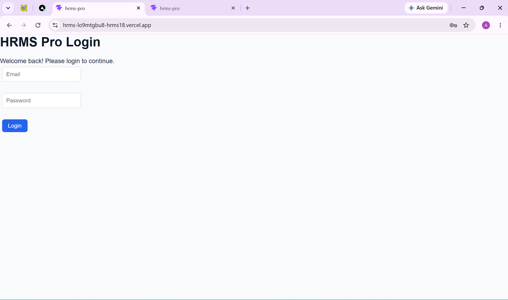
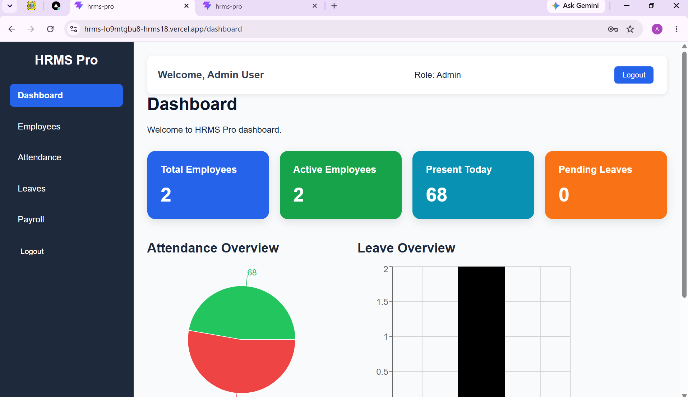
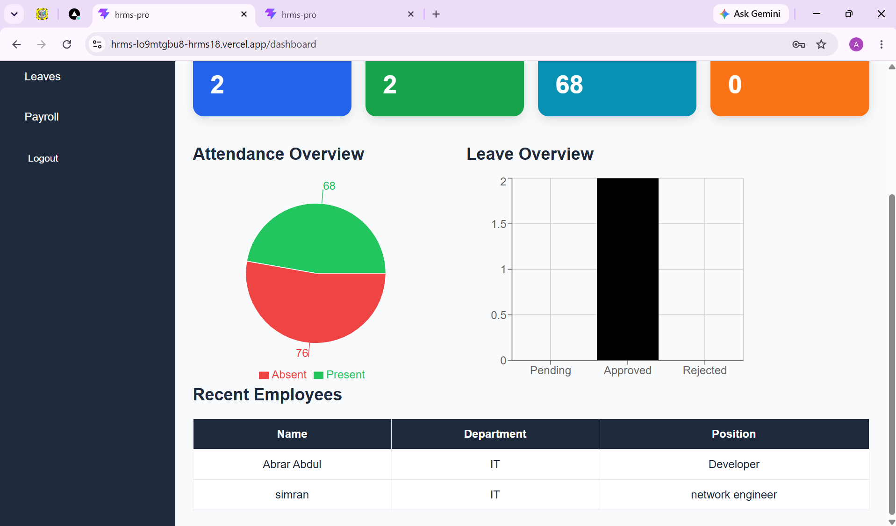
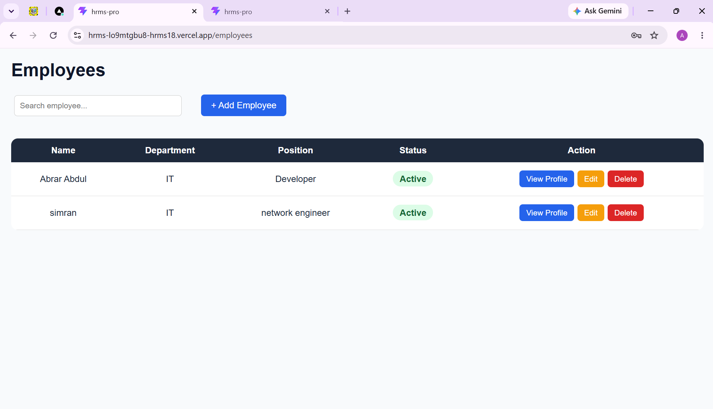
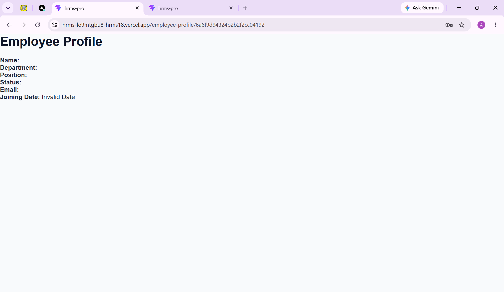
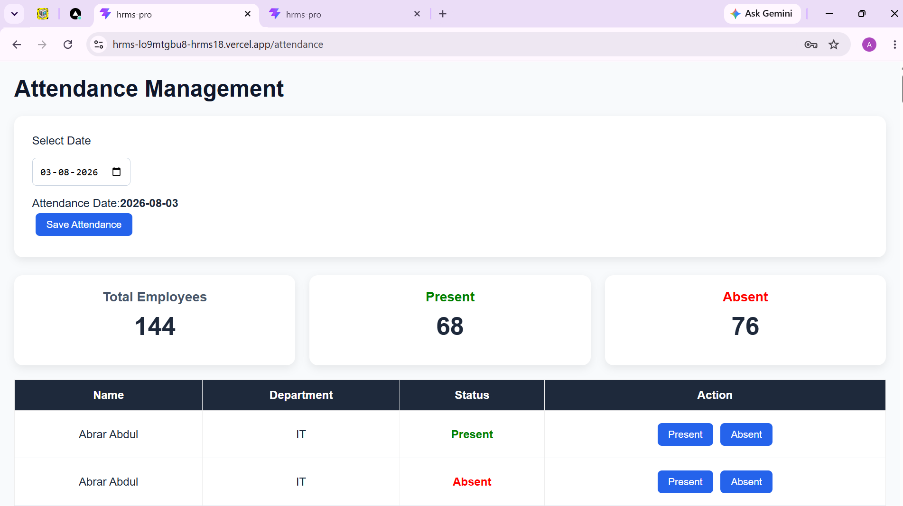
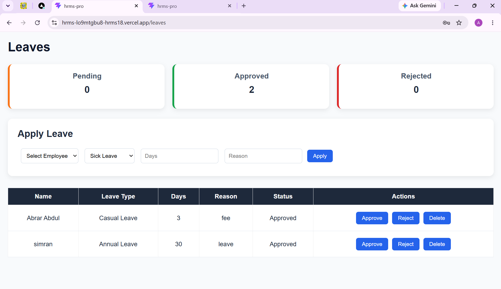
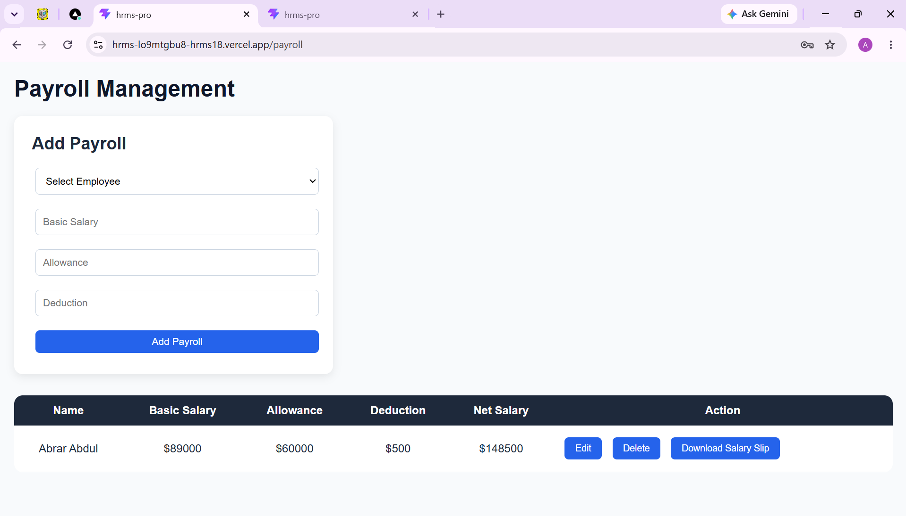

# HRMS Pro - Human Resource Management System

HRMS Pro is a modern Human Resource Management System built using React and TypeScript. It helps manage employees, attendance, leaves, payroll, and employee profiles through a clean dashboard interface.


## 🚀 Features

### Authentication
- Login system
- Protected routes
- Logout functionality

### Employee Management
- Add new employees
- Edit employee details
- Delete employees
- Search employees
- View employee profile

### Attendance Management
- Mark employees as Present/Absent
- Select attendance date
- Save attendance history
- View attendance summary

### Leave Management
- Apply leave requests
- Approve leaves
- Reject leaves
- Delete leave records
- Leave status tracking

### Payroll Management
- Add employee salary details
- Update payroll information
- Calculate net salary
- Generate salary slip PDF

### Dashboard
- Total employees count
- Active employees count
- Attendance overview
- Leave overview charts
- Recent employees list

---

## 🛠️ Technologies Used

- React.js
- TypeScript
- Vite
- HTML5
- CSS3
- JavaScript (ES6+)
- React Router
- React Context API
- Recharts
- jsPDF
- Git & GitHub

---

## 📂 Project Structure
```text
src
│
├── components
│   ├── Header.tsx
│   ├── Sidebar.tsx
│   └── ProtectedRoute.tsx
│
├── context
│   ├── EmployeeContext.tsx
│   ├── AttendanceContext.tsx
│   └── LeaveContext.tsx
│
├── layouts
│   ├── DashboardLayout.tsx
│   └── DashboardLayout.css
│
├── pages
│   ├── Login.tsx
│   ├── Dashboard.tsx
│   ├── Employees.tsx
│   ├── EmployeeProfile.tsx
│   ├── Attendance.tsx
│   ├── Leaves.tsx
│   └── Payroll.tsx
│
├── styles
│   └── global.css
│
├── App.tsx
└── main.tsx 
```

---


## ⚙️ Installation

Clone the repository:

```bash
git clone your-repository-link
```

Navigate to the project folder:

```bash
cd HRMS-Pro
```

Install dependencies:

```bash
npm install
```

Run the development server:

```bash
npm run dev
```


---

## 📸 Screenshots

### Login Page


### Dashboard




### Employee Management


### Employee Profile


### Attendance Management


### Leave Management


### Payroll Management


---

## 💡 Key Highlights

- Built with React functional components
- Developed using TypeScript
- React Context API for state management
- Protected routes for secure navigation
- Local Storage for data persistence
- Responsive user interface
- Dashboard with charts and analytics
- Salary slip PDF generation

---

## 🔮 Future Improvements

- Backend API integration
- Database integration
- User roles and permissions
- Email notifications
- Advanced reporting
- Cloud deployment

---

## 👨‍💻 Author

**Abrar Abdul**

---

## ⭐ Project Status

Completed frontend HRMS application featuring employee management, attendance tracking, leave management, payroll processing, dashboard analytics, and salary slip generation.